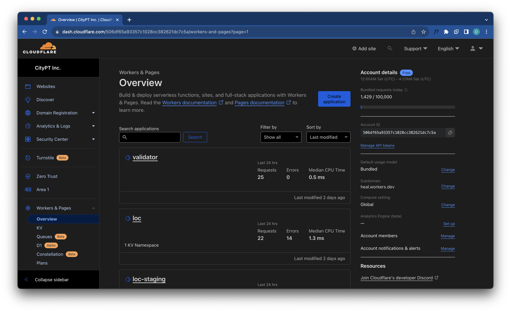
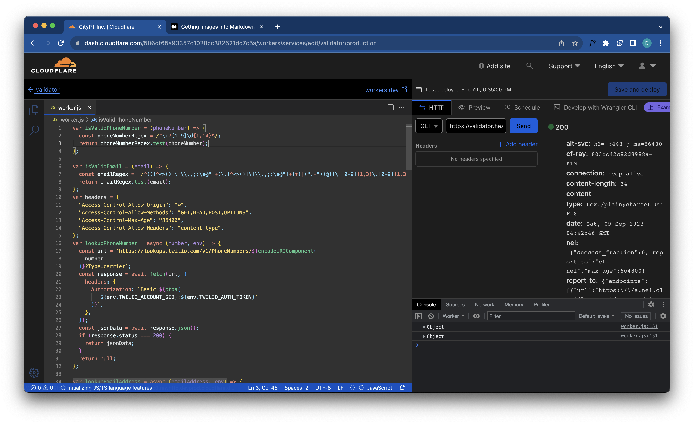
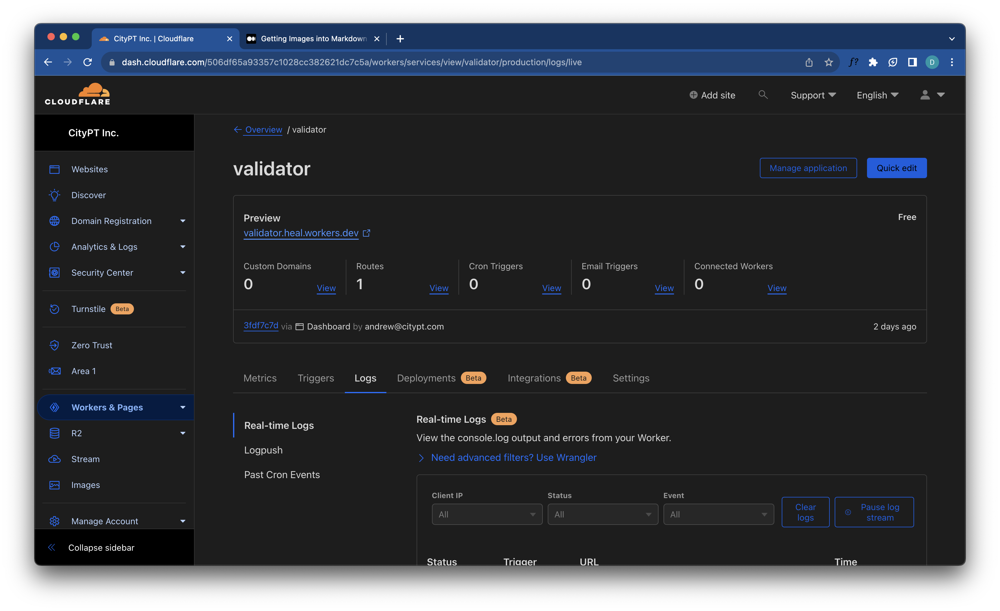

<h1 align="center">
  CityPT Website
</h1>


Welcome to the documentation for the CityPT website project. This document will provide you with essential information about the project structure, development setup, and key functionalities.

## Table of Contents

- [Tailwind Class 'Whitelist'](#tailwind-class-whitelist)
- [🚀 Quick Start](#quick-start)
- [🧐 What's Inside?](#folder-structure)
- [Adding a New Page Layout](#adding-a-new-page-layout)
- [Working with Cloudflare Workers](#working-with-cloudflare-workers)
- [Learning Gatsby](#learning-gatsby)
- [Existing Workers](#existing-workers)
## Tailwind Class 'Whitelist'

Classes that aren’t used get removed, which creates a problem if a class is being used in a non-source file, such as a markdown file. Thus, in order to preserve classes such as this, they can be ‘whitelisted’ in a hidden div in `html.js`.

## Quick Start

1. **Start Developing**

   Navigate into your new site’s directory and start it up.

   ```shell
   cd citypt-site/
   gatsby develop
   ```
2.  **Open the Source Code and Start Editing!**

    Your site is now running at `http://localhost:8000`!Open the source code

    _Note: You'll also see a second link: _`http://localhost:8000/___graphql`_. This is a tool you can use to experiment with querying your data. Learn more about using this tool in the [Gatsby tutorial](https://www.gatsbyjs.com/tutorial/part-five/#introducing-graphiql)._

    Open the `citypt-site` directory in your code editor of choice and edit any page. Save your changes and the browser will update in real time!
    
    
## Folder Structure

A quick look at the top-level files and directories you'll see in a Gatsby project.

    .
    ├── content
    ├── gatsby
    ├── node_modules
    ├── src
    ├── .gitignore
    ├── .prettierrc
    ├── gatsby-browser.js
    ├── gatsby-config.js
    ├── gatsby-node.js
    ├── gatsby-ssr.js
    ├── LICENSE
    ├── package-lock.json
    ├── package.json
    └── README.md

1.  **`/node_modules`**: This directory contains all of the modules of code that your project depends on (npm packages) are automatically installed.

2.  **`/cloudflare`** This directory contains all Cloudflare worker code.

3.  **`/src`**: This directory will contain all of the code related to what you will see on the front-end of your site (what you see in the browser) such as your site header or a page template. `src` is a convention for "source code".

4.  **`.gitignore`**: This file tells git which files it should not track / not maintain a version history for.

5.  **`.prettierrc`**: This is a configuration file for [Prettier](https://prettier.io/). Prettier is a tool to help keep the formatting of your code consistent.

6.  **`gatsby-browser.js`**: This file is where Gatsby expects to find any usage of the [Gatsby browser APIs](https://www.gatsbyjs.com/docs/browser-apis/) (if any). These allow customization/extension of default Gatsby settings affecting the browser.

7.  **`gatsby-config.js`**: This is the main configuration file for a Gatsby site. This is where you can specify information about your site (metadata) like the site title and description, which Gatsby plugins you’d like to include, etc. (Check out the [config docs](https://www.gatsbyjs.com/docs/gatsby-config/) for more detail).

8.  **`gatsby-node.js`**: This file is where Gatsby expects to find any usage of the [Gatsby Node APIs](https://www.gatsbyjs.com/docs/node-apis/) (if any). These allow customization/extension of default Gatsby settings affecting pieces of the site build process.

9.  **`gatsby-ssr.js`**: This file is where Gatsby expects to find any usage of the [Gatsby server-side rendering APIs](https://www.gatsbyjs.com/docs/ssr-apis/) (if any). These allow customization of default Gatsby settings affecting server-side rendering.

10. **`LICENSE`**: This Gatsby starter is licensed under the 0BSD license. This means that you can see this file as a placeholder and replace it with your own license.

11. **`package-lock.json`** (See `package.json` below, first). This is an automatically generated file based on the exact versions of your npm dependencies that were installed for your project. **(You won’t change this file directly).**

12. **`package.json`**: A manifest file for Node.js projects, which includes things like metadata (the project’s name, author, etc). This manifest is how npm knows which packages to install for your project.

13. **`README.md`**: A text file containing useful reference information about your project.


## Adding a New Page Layout

To add a new page layout, follow these steps:

1. Edit `onCreatePage` in `src/layouts/index.js` and add a new layout.
2. Update `gatsby-node.js` to detect pages that should use that layout, and apply it accordingly.


## Working with Cloudflare Workers

Before proceeding, please familiarize yourself with the basics of Cloudflare Workers. You can access the relevant documentation [here](https://developers.cloudflare.com/workers).


All Cloudflare worker code is stored in the `/cloudflare` directory. However, note that this code is for reference only. Worker deployment and management are handled through the Cloudflare dashboard.


### Cloudflare Dashboard
Here is a reference image of the Cloudflare dashboard:


We utilize cloud-based development for Cloudflare workers. The Cloudflare editor allows us to edit code, view logs, and trigger workers as needed.

### Cloudflare Editor
Here is a reference image for the Cloudflare editor:


When developing a new service, we establish both a staging and production environment. This allows us to thoroughly test our code in the staging environment before deploying it to production.Once we are satisfied with the code's performance in the staging environment, we commit it to the `/cloudfare` folder in our repository.


### View production logs

To view production logs you can go to the worker and click logs tab and begin a realtime log streaming.




### Cloudflare KV

We utilize Cloudflare's Key-Value (KV) store to persistently store data such as city details. When creating a new KV, ensure to create two instances: one for staging and one for production.

These KV instances can then be attached to their respective worker environments.

## Learning Gatsby
Looking for more guidance? Full documentation for Gatsby lives [on the website](https://www.gatsbyjs.com/). Here are some places to start:

- **[In-Depth Tutorial](https://www.gatsbyjs.com/tutorial/).** Start with a tutorial that walks through the entire site creation process.

- **[Documentation](https://www.gatsbyjs.com/docs/).** Dive into code samples, guides, API references, and advanced tutorials.

## Existing Workers

### City Resolver
#### Description:
The `cloudflare/city-resolver.js` script is a Cloudflare Worker that acts as a proxy for a website. It is configured to handle requests to a primary website and a mobile website, with the ability to block requests from certain regions or IP addresses.


#### Functionality:

1. The script listens for fetch events and responds with the result of the `fetchAndApply` function. 
2. This function retrieves city data stored in cloudflare KV 
3. Parses request headers to get the region, IP address, and user agent
4. Modifies the request URL based on these details and the script’s configurations. 
5. The cities values in KV is procesed and stored in gatsby’s create page lifecycle where we have access to the cities data.

#### Key Features:
One of the key features of this script is its ability to modify the request based on the user’s city. If the user’s city is present in the cities variable, the script calculates the distance between the user’s location and the city using the Google Maps API. This information can then be used to modify the request or response, for example, to redirect the user to a city-specific version of the website.


#### Additional Functions:
- `replace_response_text`: Replaces text in the response.
-  `device_status`: Determines if the request originates from a mobile device.
- `getDistance`: Calculates distance using the Google Maps API.
- `isBot`: Checks if the request is from a bot.

### Loc

It uses the Cloudflare's `cf` object to get the user's location data such as country, city, and region. It then fetches a list of cities from a data source and tries to match the user's city with the cities in the list. If the user's city is not found, it calculates the distance between the user's location and all the cities in the same state, and assigns the closest city to the user. The response includes the user's location data, whether the user is from the USA, and the destination city's name and ID.


### Testing via Web Interface

To test your Cloudflare Worker via a web interface, you can use the Cloudflare Workers dashboard. Here's a step-by-step guide:


1. **Navigate to the Cloudflare Workers dashboard**: Log in to your Cloudflare account and select the relevant domain. Then, navigate to the "Workers" section.

2. **Select Your Worker**: In the list of your workers, click on the worker you want to test. This will open the worker editor.

3. **Set Up Your Test**: In the right panel of the worker editor, you can set up your test. You can specify the request method (GET, POST, etc.), the request URL, and any headers or body content for your request.

4. **Change Variables Manually**: In the worker script in the left panel, you can manually change the values of variables such as `upstream`, `upstream_mobile`, `blocked_region` , `blocked_ip_address` , and `cities` .

5. **Run the Test**: Click the "Send" button to send the request and run the worker. The response will be displayed in the "Response" section.

6. **Check the Responses**: Check the response status, headers, and body to see if they match your expectations. For example, if you have blocked a certain region, you should see a 403 response when sending a request from that region.

7. **Test the Distance Calculation**: You can test the distance calculation functionality by setting the `cf` object in your requests to different `cities` that are present in the cities variable. The worker should correctly calculate the distance and modify the request URL accordingly.

Remember to thoroughly test all the different parts of your worker script to ensure it behaves as expected in all scenarios.

### Validator

The provided code is a JavaScript file that exports a Cloudflare worker. This worker handles HTTP requests and performs phone number validation using a regular expression and Twilio's Lookup API.

#### The worker handles different HTTP methods:

- For **OPTIONS requests**, it responds with CORS headers.
- For **POST requests**, it expects a JSON body with a type of "phonenumber" and a value containing the phone number to validate. If the phone number is valid and is from the US according to Twilio's Lookup API, it responds with a JSON object containing `{ isValid: true, twilioResponse }`. If the phone number is invalid or not from the US, it responds with a JSON object containing `{ isValid: false, message: "Invalid phone number", twilioResponse }`.
- For **other HTTP methods**, it responds with a JSON object containing `{ statue: "Api validator running" }`.

Here are some example requests and ways to test this worker:

1. **OPTIONS Request**:
You can send an OPTIONS request to the worker's URL and expect a response with CORS headers.

2. **POST Request with Valid US Phone Number**:
>
Replace `<worker_url>` with the actual URL of the worker. You should receive a response with `{ isValid: true, twilioResponse }`.

3. **POST Request with Invalid Phone Number**:
>
You should receive a response with `{ isValid: false, message: "Invalid phone number" }`.

4. **POST Request with Non-US Phone Number**:

You should receive a response with `{ isValid: false, message: "Invalid phone number", twilioResponse }`.

5. **GET Request**:
>
You should receive a response with `{ statue: "Api validator running" }`.

Remember to replace `<worker_url>` with the actual URL of the worker in all the above examples.
